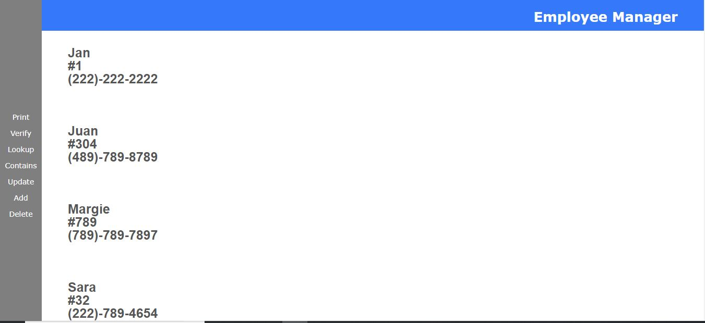

# UI for Employee List

This is a single-page application. Front-end use HTML, CSS, Javascript, JQuery.

## Functionality includes

### Print Option

If the option selected is `Print`, display all the employee names, office numbers, and telephone numbers on the page.

### Verify Option

If the option selected is `Verify`, display an input box to get the employee name. When the `Verify` button is clicked, if the employee name is found, display `Employee Found`. If the employee is not found, display `Employee Not Found`.

### Lookup Option

When the `Lookup` button is clicked, display the employee information. If the employee is not found, display `Employee Not Found`.

### Contains Option

When the `Contains` button is clicked, display any employees' information that matches the partial name. If no employees are found, display `Employees Not Found`.

### Update Option

When the `Update` button is clicked, display the employee's new updated information. If no employee was found, display `Employee Not Found`.

### Add Option

When the `Add` button is clicked, display the new employee's information.

### Delete Option

When the `Delete` button is clicked, `Employee Deleted` if the employee was found and successfully deleted. If the employee was not found, display `Employee Not Found`.
